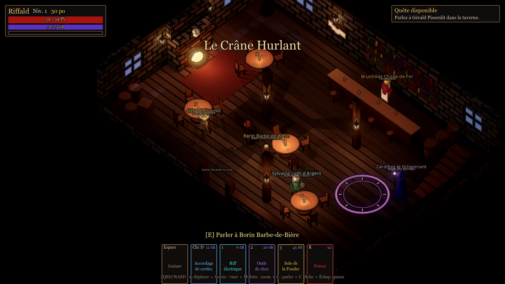
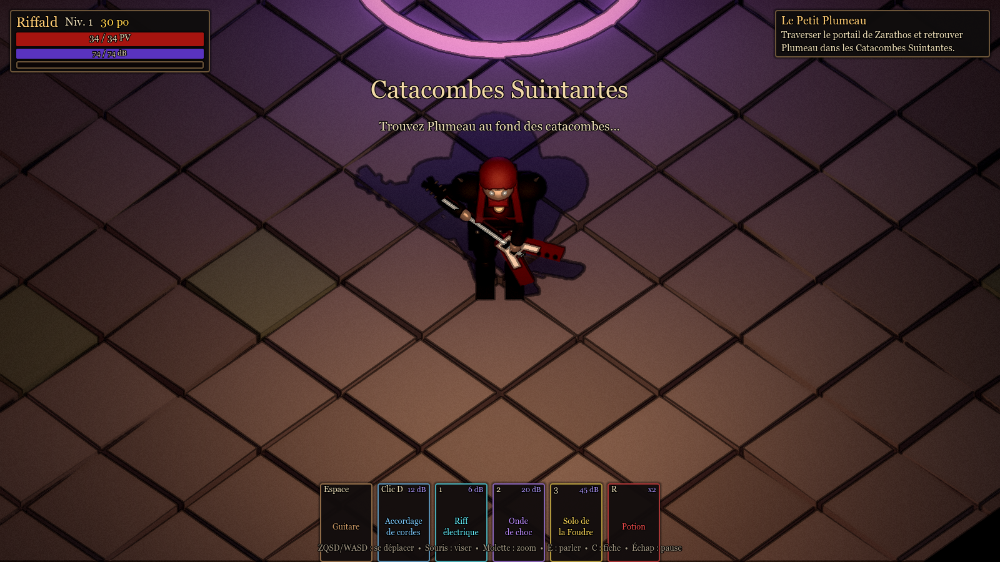
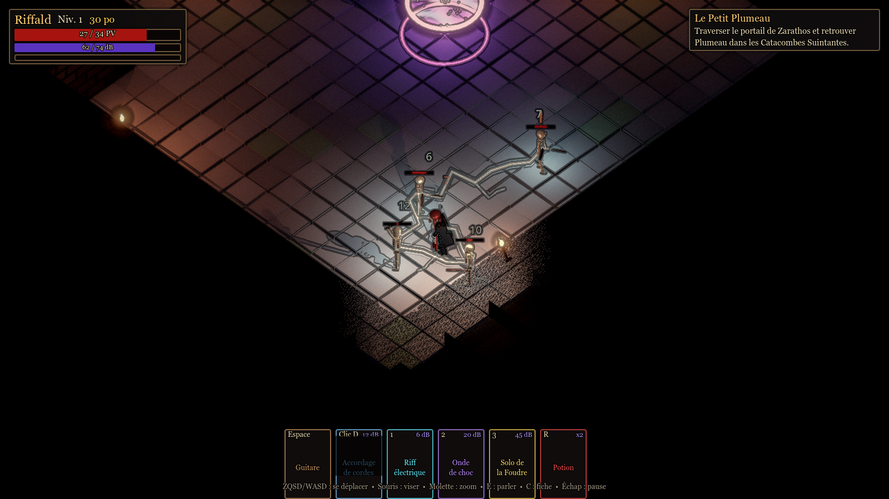
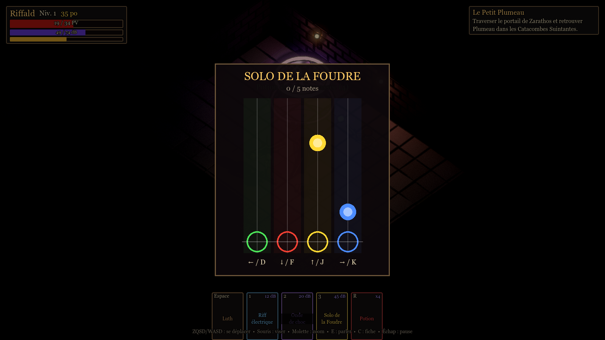
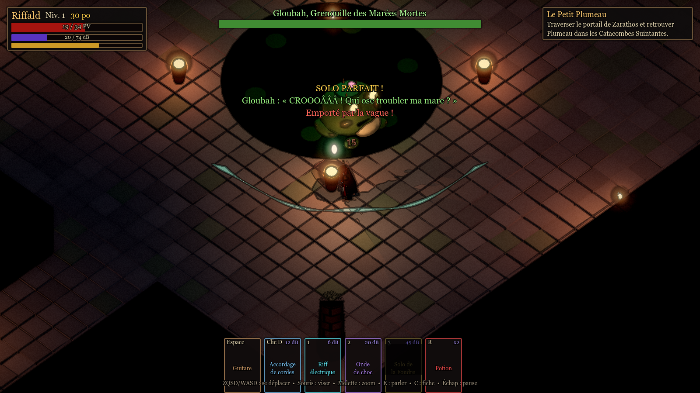

# 🤘 METAL BARD — La Ballade de l'Ours-Hibou

**Hack'n'slash isométrique dark fantasy sous Godot 4.7.**
Un barde metal, sa Flying V électrique, quatre sorts de foudre et de son… et une armée de squelettes qui chantent faux.



| Riffald et sa Flying V | Accordage de cordes (5 cibles) | Solo de la Foudre (sans pause, invincible) | Boss — Gloubah |
|---|---|---|---|
|  |  |  |  |

## Le jeu en bref

- **Vue isométrique façon Diablo**, ambiance sombre façon **Darkest Dungeon** (contours encrés, vignette, torches vacillantes).
- **Héros** : Riffald, barde à crinière rousse inspiré de Dave Mustaine et Ronnie James Dio, armé d'une réplique de **Gibson Flying V** portée bas comme un guitariste de metal, avec la posture voûtée et la démarche claudicante des **Réprouvés de World of Warcraft**.
- **Taverne-hub** « Le Crâne Hurlant » : 6 PNJ, dialogues à choix, boutique, repos, tableau des quêtes.
- **Première quête complète** : retrouver Plumeau, le bébé ours-hibou de Gérald, dans de vastes **catacombes générées procéduralement** (salles de 16 à 26 m, couloirs de 6 m, torches espacées), jusqu'au **boss Gloubah**, grenouille géante aux vagues déferlantes.
- **Arsenal** :
  - **Coup de guitare** au corps-à-corps (empoignée par le manche) ;
  - **Accordage de cordes** (clic droit) : arc électrique qui rebondit sur jusqu'à 5 ennemis ;
  - **Riff électrique** (1) : une seule cible ; en appuyant **en rythme**, les dégâts montent en 4 paliers jusqu'à **×3**, et restent au maximum tant qu'on garde le tempo (métronome dans le HUD) ;
  - **Onde de choc** sonore (2) : tous les ennemis dans un rayon ;
  - **Solo de la Foudre** (3) : mini-jeu façon *Guitar Hero* (5 notes, touches **1 2 3 4**) **sans pause** — le héros est **invincible** pendant le solo — puis pluie d'éclairs sur tout l'écran.
- **Règles Donjons & Dragons 5e** : FOR / DEX / CON / INT / SAG / CHA, jets d'attaque d20 contre la CA, sauvegardes, table d'XP officielle, points à répartir à chaque niveau.
- **IA des squelettes** : errance aléatoire, détection à 4 m, vitesse = 25 % du héros, 1 attaque toutes les 2,5 s (avec élan visible pour esquiver).
- **Musiques metal** en boucle pour la taverne et le donjon (`audio/music/`), bruitages **synthétisés par code**, « voix » babillées pendant les dialogues.
- **Menu Options > Audio** (écran titre et menu pause) : volumes indépendants **Musique**, **Sorts et effets**, **Dialogues**, sauvegardés automatiquement. Sauvegarde de partie automatique.

## Lancer le jeu

1. Installer **[Godot 4.7](https://godotengine.org/download)** (version standard, pas .NET).
2. Cloner ce dépôt :
   ```bash
   git clone https://github.com/<ton-compte>/metal-bard.git
   ```
3. Dans Godot : **Importer** → choisir `metal-bard/project.godot` → **Exécuter** (F5).

## Contrôles

| Action | Touche |
|---|---|
| Se déplacer | **ZQSD** (AZERTY) / **WASD** (QWERTY) / flèches |
| Viser | Souris |
| Coup de guitare | **Espace** ou clic gauche |
| Accordage de cordes | **Clic droit** |
| Riff électrique (en rythme !) / Onde de choc / Solo | **1** / **2** / **3** |
| Mini-jeu du solo | **1 2 3 4** |
| Potion | **R** |
| Parler / interagir | **E** |
| Fiche de personnage | **C** |
| Zoom | Molette |
| Pause | Échap |

## Documentation

- 📜 **[Game Design Document](docs/GDD.md)** — univers, personnages, règles, combat, boss, quêtes, multijoueur.
- 🏗️ **[Architecture technique](docs/ARCHITECTURE.md)** — organisation du code, ajouter des quêtes / ennemis / sorts.
- 🗺️ **[Feuille de route](docs/ROADMAP.md)** — de ce prototype à la coop à 6 joueurs.

## Équilibrage

Toutes les valeurs (vitesses, dégâts, recharges, rayon de détection, prix…) sont réunies dans
[`scripts/rpg/balance.gd`](scripts/rpg/balance.gd) : modifie-les sans toucher au reste du code.

## Tests

```bash
Godot_v4.7.2-stable_win64_console.exe --headless --path . res://tests/smoke_test.tscn
```
Le test vérifie les règles D&D, génère 50 donjons et joue toute la quête (taverne → donjon → boss → récompense → sauvegarde).

## État du projet

Prototype **v0.1** : tous les graphismes sont faits de formes simples générées par code, en attendant de vrais modèles 3D. Voir la [feuille de route](docs/ROADMAP.md).
