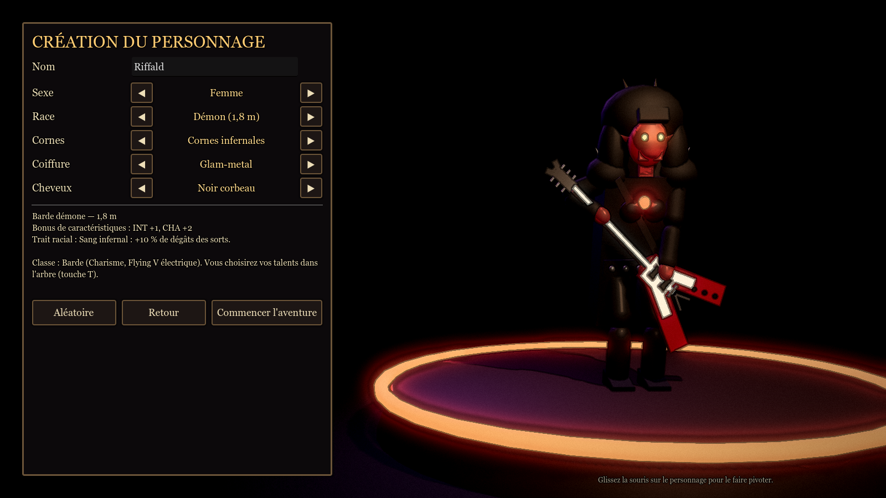
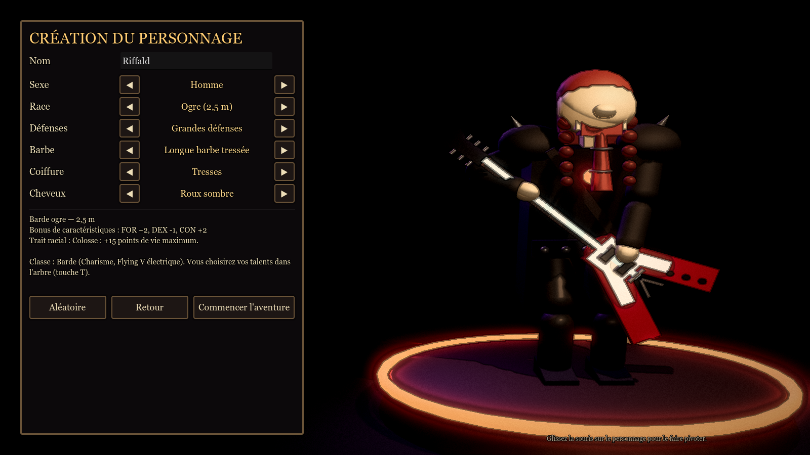
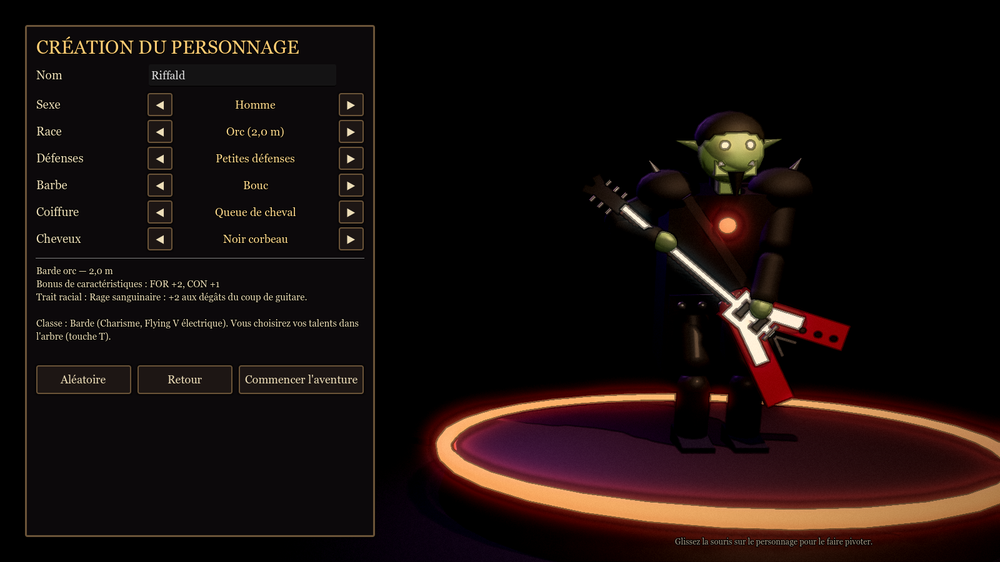
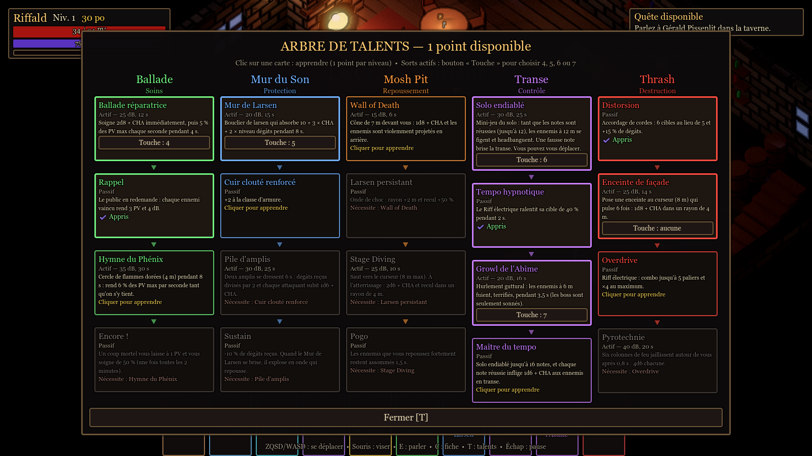
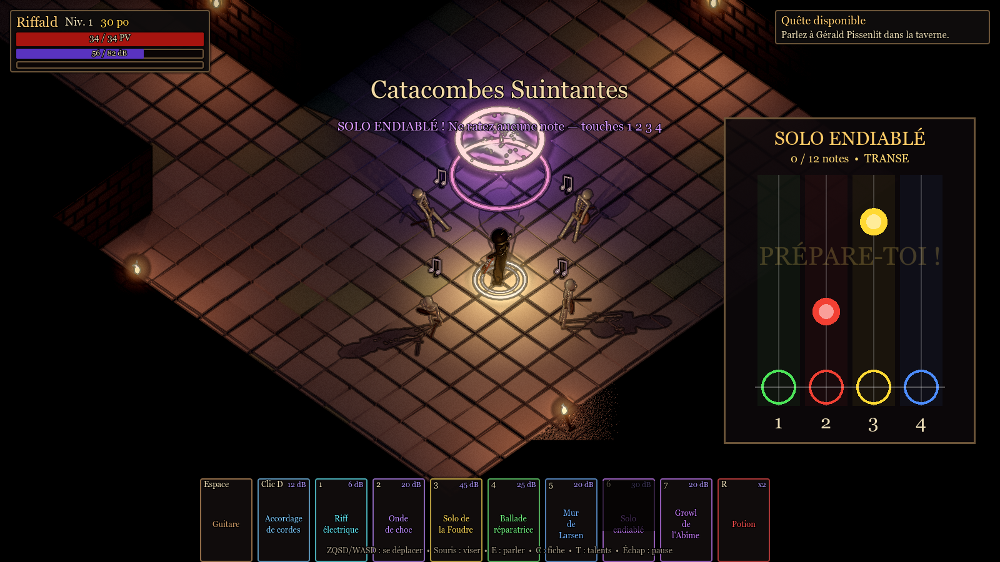

# 🤘 METAL BARD — La Ballade de l'Ours-Hibou

**Hack'n'slash isométrique dark fantasy sous Godot 4.7.**
Un barde metal, sa Flying V électrique, quatre sorts de foudre et de son… et une armée de squelettes qui chantent faux.


| Riffald et sa Flying V | Accordage de cordes (5 cibles) | Solo de la Foudre (sans pause, invincible) | Boss — Gloubah |
|---|---|---|---|
|  |  |  |  |

## Le jeu en bref

- **Vue isométrique façon Diablo**, ambiance sombre façon **Darkest Dungeon** (contours encrés, vignette, torches vacillantes).
- **Héros** : un barde que vous créez (6 races, homme ou femme ; par défaut Riffald, inspiré de Dave Mustaine et Ronnie James Dio), armé d'une réplique de **Gibson Flying V** portée bas comme un guitariste de metal, avec la posture voûtée et la démarche claudicante des **Réprouvés de World of Warcraft**.
- **Intro** : la nuit de la **Lune de Sang**. Cinématique sur une lune sanglante dans la brume, puis un cimetière près d'une chapelle : tombes déterrées et vides, cadavres de toutes les races. Le héros lâche « Aaaaaah... une bonne vieille balade par ce temps est si agréable. Et si j'allais m'en jeter un ! » (« Et si nous allions nous en jeter un ! » en coop), puis ~40 s de marche sur une route pavée entre champs et prairies, cadavres ensanglantés et chauves-souris, sous un orage sans pluie (éclairs hors de la route, flashs, tremblements d'écran). Les portes de la taverne se referment derrière lui.
- **Taverne-hub** « Le Crâne Hurlant » sur 3 niveaux :
  - salle commune : clients générés aléatoirement qui reculent leur chaise, vont au comptoir et jurent (« Yeah ! », « Enfer et damnation ! », « Bordel ! », « Ça, c'est Metal ! ») ; jamais plus de 2 debout à la fois ;
  - étage avec les chambres ;
  - **sous-sol d'entraînement** : mannequins, cible amicale, **dB illimités**, et un **portail démoniaque rouge sang** dans une zone brumeuse, d'où sortent cinq tentacules.
  - Zarathos fait les cent pas près de son cercle de runes. L'Inconnue encapuchonnée **réinitialise l'arbre de talents**.
- **Première quête complète** : retrouver Plumeau, le bébé ours-hibou de Gérald, dans de vastes **catacombes générées procéduralement** (salles de 16 à 26 m, couloirs de 6 m, torches espacées).
  - **Rats** (3 PV) un peu partout ; salles cul-de-sac gardées par une douzaine de squelettes.
  - **Boss Gloubah**, grenouille géante trônant sur un **pentagramme de bave verte**, la gueule ensanglantée. Elle vous parle d'abord : selon vos réponses (rien n'indique lesquelles mènent au combat), elle se bat, vous enferme dans une cage… ou devient amicale et vous donne la clé (XP doublée).
  - Compteur de victimes, puis **récapitulatif** en fin de donjon (dégâts infligés, subis, évités).
- **Arsenal** :
  - **Coup de guitare** au corps-à-corps (clic gauche, empoignée par le manche) ;
  - **Glissade sur les genoux** (Espace) : 5 m, **esquive toutes les attaques**, recharge 20 s. Une esquive passive réussie déclenche un petit saut sur une jambe façon **Angus Young** ;
  - **Accordage de cordes** (clic droit) : arc électrique qui rebondit sur jusqu'à 5 ennemis ;
  - **Riff électrique** (1) : une seule cible ; en appuyant **en rythme**, les dégâts montent en 4 paliers jusqu'à **×3**, et restent au maximum tant qu'on garde le tempo (métronome dans le HUD) ;
  - **Onde de choc** sonore (2) : tous les ennemis dans un rayon ;
  - **Solo de la Foudre** (3) : mini-jeu façon *Guitar Hero* (5 notes, touches **1 2 3 4**) **sans pause** — le héros est **invincible** pendant le solo — puis pluie d'éclairs sur tout l'écran.
- **Règles Donjons & Dragons 5e** : FOR / DEX / CON / INT / SAG / CHA, jets d'attaque d20 contre la CA, sauvegardes, table d'XP officielle, points à répartir à chaque niveau.
- **IA des squelettes** : errance aléatoire, détection à 4 m, vitesse = 25 % du héros, 1 attaque toutes les 2,5 s (avec élan visible pour esquiver).
- **Musiques metal** en boucle pour la taverne et le donjon (`audio/music/`), bruitages **synthétisés par code**, « voix » babillées pendant les dialogues.
- **Menu Options > Audio** (écran titre et menu pause) : volumes indépendants **Musique** (50 % plus bas par défaut), **Sorts et effets**, **Dialogues**.
- **Sauvegarder / Charger** : 5 emplacements + la sauvegarde automatique, dans le menu pause (impossible en plein combat) et sur l'écran titre ; on reprend au même endroit.
- **Monnaie : les médiators.**
- **Coopération en ligne** jusqu'à 6 joueurs avec un **code d'invitation** (voir plus bas).

## Création de personnage

À chaque **nouvelle partie** : nom, **sexe** (homme / femme) et **race**, avec un aperçu 3D sur scène.

| Race | Taille | Bonus | Trait racial | Options |
|---|---|---|---|---|
| Humain | 1,8 m | +1 partout | +10 % d'XP | barbe (hommes) |
| Squelette | 1,8 m | DEX +2, CON +1 | les squelettes ennemis ne vous repèrent qu'à 3 m | — |
| Orc | 2 m | FOR +2, CON +1 | +2 aux dégâts du coup de guitare | 3 défenses, barbe |
| Troll | 2,2 m | CON +2, FOR +1 | régénère 1 PV / 2 s | 3 défenses, barbe |
| Ogre | 2,5 m | FOR +2, CON +2, DEX −1 | +15 PV max | 3 défenses, barbe |
| Démon | 1,8 m | CHA +2, INT +1 | +10 % de dégâts des sorts | 3 cornes, barbe |

Pour tous : **3 barbes** (hommes : courte, longue tressée, bouc), **4 coiffures longues** (tresses, queue de cheval, longs lâchés, glam-metal) et 5 couleurs de cheveux.

| Démone glam-metal | Ogre | Orc |
|---|---|---|
|  |  |  |

## Arbre de talents (touche T)

5 branches de 4 talents, **1 point par niveau** (dont 1 dès le niveau 1), paliers à débloquer dans l'ordre. Les sorts actifs se placent sur les touches **4 à 7**.

| Branche | Palier 1 | Palier 2 | Palier 3 | Palier 4 |
|---|---|---|---|---|
| **Ballade** (soins) | Ballade réparatrice | Rappel *(passif)* | Hymne du Phénix | Encore ! *(passif)* |
| **Mur du Son** (protection) | Mur de Larsen | Cuir clouté renforcé *(passif)* | Pile d'amplis | Sustain *(passif)* |
| **Mosh Pit** (repoussement) | Wall of Death | Larsen persistant *(passif)* | Stage Diving | Pogo *(passif)* |
| **Transe** (contrôle) | **Solo endiablé** | Tempo hypnotique *(passif)* | Growl de l'Abîme | Maître du tempo *(passif)* |
| **Thrash** (destruction) | Distorsion *(passif)* | Enceinte de façade | Overdrive *(passif)* | Pyrotechnie |

**Ballade réparatrice** : mini-jeu sur le **vrai solo de guitare de la musique de la taverne**, extrait par analyse du morceau (126 s → 136 s, 23 notes). Chaque note juste soigne tout le groupe ; un solo sans faute (10 s) rend 90 % des PV max ; une fausse note arrête la ballade.

Tout mini-jeu raté (Solo de la Foudre, Solo endiablé, Ballade) rend la recharge du sort **2,5 fois plus longue**.

**Solo endiablé** : le mini-jeu du solo se lance ; tant que les notes sont réussies (jusqu'à 12, ou 16 avec *Maître du tempo*), les ennemis à 12 m se figent et **headbanguent** sans bouger. La première fausse note brise la transe. Le héros peut se déplacer pendant ce solo.

| Arbre de talents | Solo endiablé |
|---|---|
|  |  |

## Coopération (code d'invitation)

1. L'hôte lance sa partie, puis **Échap → Coopération (inviter des amis) → Ouvrir ma partie**. Un code du type **`3F7QK-2M9XA`** s'affiche, avec un bouton « Copier le code ».
2. Les amis choisissent **Rejoindre une partie (coop)** sur l'écran titre et collent le code. Ils arrivent avec **leur propre personnage** (celui de leur dernière sauvegarde), quel que soit leur niveau.
3. L'hôte fait autorité (ennemis, boss). Chacun voit les autres joueurs, gagne l'XP et ramasse son propre butin ; les soins de groupe soignent tout le monde ; quand l'hôte change de lieu, le groupe le suit.

Le jeu ouvre le port **UDP 24565** sur la box par UPnP. Si la box refuse, le code fonctionne en réseau local ou via un VPN (Tailscale, ZeroTier) ; sinon, il faut ouvrir ce port à la main.

*Première version :* les dialogues de quête, la clé et la cage de Gloubah sont gérés chez l'hôte.

## Objets

Tous les objets du jeu (reliques, potion, chambre, médiators, clé de la cage) sont listés dans **[`data/items.json`](data/items.json)**. Vous y contrôlez noms, descriptions, bonus, rareté, butin, prix et activation. Détails : **[docs/OBJETS.md](docs/OBJETS.md)**.

## Lancer le jeu

1. Installer **[Godot 4.7](https://godotengine.org/download)** (version standard, pas .NET).
2. Cloner ce dépôt :
   ```bash
   git clone https://github.com/<ton-compte>/metal-bard.git
   ```
3. Dans Godot : **Importer** → choisir `metal-bard/project.godot` → **Exécuter** (F5).

## Contrôles

| Action | Touche |
|---|---|
| Se déplacer | **ZQSD** (AZERTY) / **WASD** (QWERTY) / flèches |
| Viser | Souris |
| Coup de guitare (ou parler / interagir en cliquant sur quelqu'un) | **Clic gauche** |
| Glissade sur les genoux | **Espace** |
| Accordage de cordes | **Clic droit** |
| Riff électrique (en rythme !) / Onde de choc / Solo | **1** / **2** / **3** |
| Mini-jeu du solo | **1 2 3 4** |
| Sorts de talents | **4 5 6 7** |
| Arbre de talents | **T** |
| Potion | **R** |
| Parler / interagir | **E** |
| Fiche de personnage | **C** |
| Zoom | Molette |
| Pause | Échap |

## Documentation

- 📜 **[Game Design Document](docs/GDD.md)** — univers, personnages, règles, combat, boss, quêtes, multijoueur.
- 🏗️ **[Architecture technique](docs/ARCHITECTURE.md)** — organisation du code, ajouter des quêtes / ennemis / sorts.
- 🗺️ **[Feuille de route](docs/ROADMAP.md)** — de ce prototype à la coop à 6 joueurs.

## Équilibrage

Toutes les valeurs (vitesses, dégâts, recharges, rayon de détection, prix…) sont réunies dans
[`scripts/rpg/balance.gd`](scripts/rpg/balance.gd) : modifie-les sans toucher au reste du code.

## Tests

```bash
Godot_v4.7.2-stable_win64_console.exe --headless --path . res://tests/smoke_test.tscn
```
Le test (100 vérifications) contrôle :
- les règles D&D et la génération de 50 donjons ;
- toute la quête, avec les trois issues du dialogue de Gloubah ;
- la Ballade, la glissade, la taverne (clients, portes, sous-sol) ;
- les sauvegardes, le code de coop et l'intro.

## État du projet

Prototype **v0.1** : tous les graphismes sont faits de formes simples générées par code, en attendant de vrais modèles 3D. Voir la [feuille de route](docs/ROADMAP.md).
